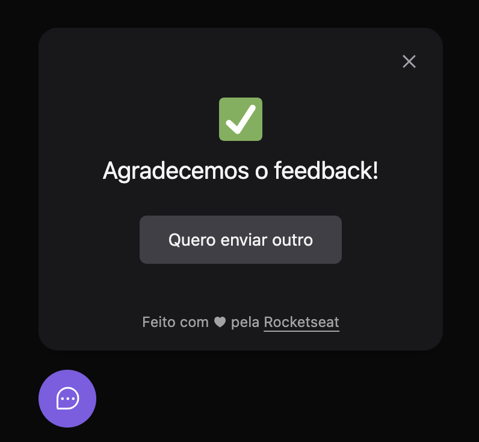

# Widget Feedback card - back-end

Aplicação back-end desenvolvida durante a [Next Level Week Return da Rocketseat](https://nextlevelweek.com/).


https://user-images.githubusercontent.com/43016358/166611595-c2a8d446-d563-4cea-80cd-92b2c1e15ba9.mov

<div style="display: inline-flex; flex-wrap: wrap; gap: 12px;">
  

  

  
</div>

<br />

Desenvolmento em NodeJS e Express, salva os dados de Feedback do front e envia email para o admin a cada novo feedback recebido.

<br />

---

## How to

### Instalação
```bash
yarn
```

### Rodar o projeto

```bash
yarn dev
```

### Rodar Prisma Studio

Interface para visualização da database local.

```bash
npx prisma studio
```

---

## Tecnologias

🚀 [NodeJS](https://nodejs.org/en/)

✨ [Typescript](https://www.typescriptlang.org/)

✨ [Express](https://expressjs.com/pt-br/)

✨ [PostgreSQL](https://www.postgresql.org/)

🛠 [Prisma](https://www.prisma.io/)

🛠 [MailTrap](https://mailtrap.io/)

🛠 [ts-node-dev](https://github.com/wclr/ts-node-dev#readme)

🛠 [Cors](https://www.npmjs.com/package/cors)

🛠 [Jest](https://jestjs.io/pt-BR/)

### DEPLOY

🚀 Back-end: [Railway](https://railway.app/)

---

## Material complementar

[Notion](https://efficient-sloth-d85.notion.site/NLW-Return-4e1cf60ece8f42d08254810f7bb14401)

[**FRONT**](../web/README.md)

[**BACK**](../server/README.md)
