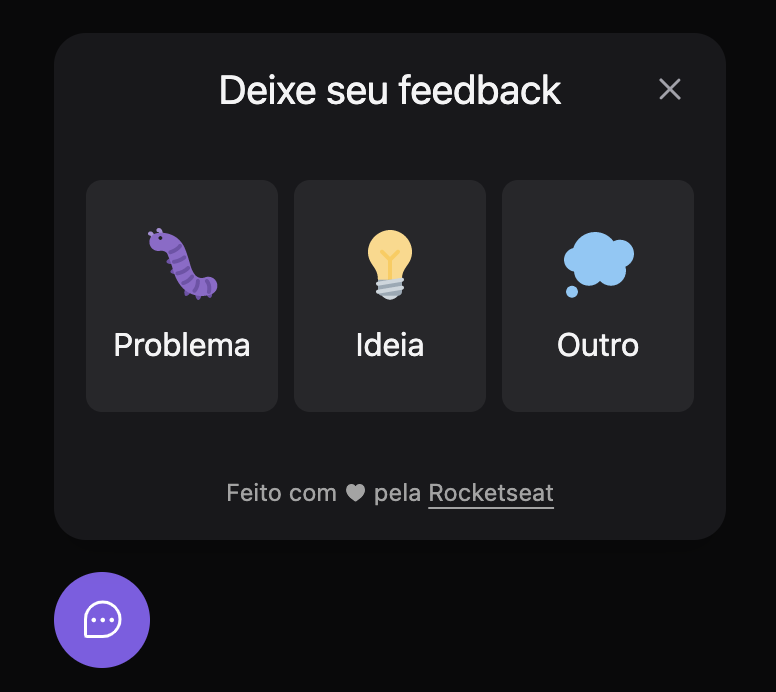
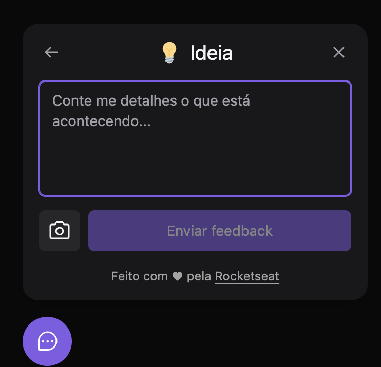
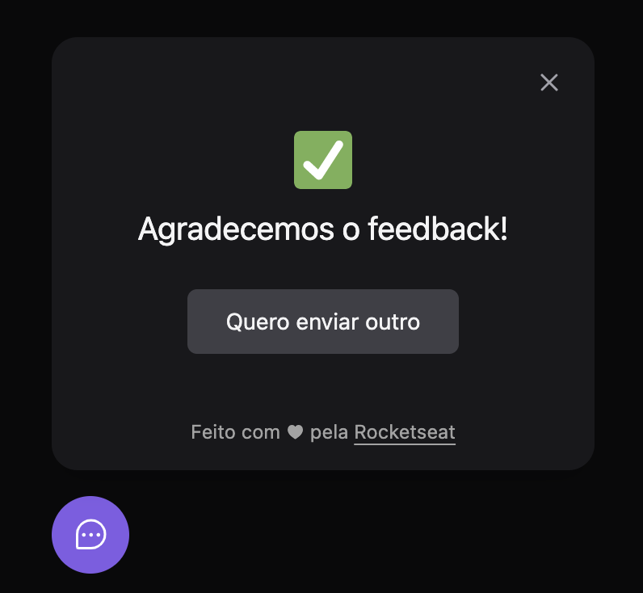

# Widget Feedback card - web
Widget de Feedback em ReactJS e Vite desenvolvido durante a [Next Level Week Return da Rocketseat](https://nextlevelweek.com/).


## Demo

<div style="display: inline-flex; flex-wrap: wrap; gap: 12px;">
  

  

  
</div>

<br />

## Link

🔗 https://nlw-feedback-card.vercel.app/

---

## How to

### Instalação
```bash
yarn
```

### Rodar o projeto

```bash
yarn dev
```

---

## Tecnologias

🚀 [React](https://pt-br.reactjs.org/)

✨ [Typescript](https://www.typescriptlang.org/)

✨ [Vite](https://vitejs.dev/)

🛠 [TailwindCss](https://tailwindcss.com/)

🛠 [Material UI - Popover](https://mui.com/pt/material-ui/react-popover/)

### DEPLOY

🚀 Web: [Vercel](https://vercel.com/)

---

## Material complementar

[Notion](https://efficient-sloth-d85.notion.site/NLW-Return-4e1cf60ece8f42d08254810f7bb14401)

[**FRONT**](../web/README.md)

[**BACK**](../server/README.md)
